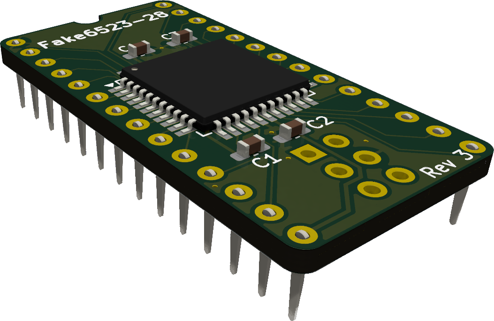

# Fake6523-28
This is a replacement for the 28-pin version of the MOS 6523 tri-port interface used in the Commodore 1551 paddle.

This replacement is pretty much a scaled down version of the 40-pin [Fake6523](https://github.com/go4retro/Fake6523) created by Jim Brain. 
The verilog code for the CPLD is based on code created by Maciej Witkowiak for the [TCBM2SD](https://github.com/ytmytm/plus4-tcbm2sd).  

## About the 6523

There is no datasheet available for the 28-pin version of the 6523. I'm guessing it was a modification that was made exclusively for the 1551 to fit in the paddle. They seem to be branded either 6523T or 6523A. 
It is quite similar to the 40-pin version but instead of three 8-bit ports it only has one 8-bit port (A) and two 2-bit ports (B and C). Some [old instructions](ref/1551-tia.gif) were available that let you replace a 28-pin 6523 with a 40-pin 6523 or 6525 using an adapter. I based my PCB design on those instructions.

I've tested a real 6523T to find out how it behaves in various conditions and this is what I found. Some of it is obvious and some of it is my best guesses.  
The two 2-bit ports and their corresponding DDR registers are all 8-bit registers internally. The other six bits in a 2-bit port (let's call them extra bits) are all there. They are just not connected to any external pins.
Eight bits can be written to them and wile the bits are configured as outputs (1) in the DDR registers, the same eight bits can be read back from the port register.  
When the extra bits are switched to inputs (0) in the DDR register, they start to float. At first, they retain the data that was last written to the port register but after a second or so, the extra bits start to toggle. The behaviour may seem conistent but it only is until it isn't :)

## Design history

### Rev 1

Revision 1 is based on the obsolete, yet still available CPLD XC9572XL-10VQ64 (VQFP-64).  
I chose to replicate the output funtionality with eight bits in all ports in this version of the HDL. The extra bits are normally not used by the 1551 and the drive works fine without that functionality but if some third party software like a highly optimized loader would use the extra bits for anything, it feels good to have them there for compatibility.

The firmware for Rev 1 is available in the [rev1/hdl](rev1/hdl) folder. There are compiled files in jed and svf formats and the source code is available as a Xilinx ISE project.

### Rev 2
This was a development revision that wasn't released.

### Rev 3

Revision 3 is based on the still active CPLD ATF1504AS (TQFP-44). 
The ATF1504AS is a 5V part. No voltage regulator is necessary and the Atmel CPLD is cheaper than the Xilinx CPLD so the design is simpler and cheaper than the Xilinx design.
  
Beacuse the ATF1504 has less macro cells, the logic had to be simplified. PORTB and PORTC has been limited internally to two bits each and the unconnected extra bits in PORTB and PORTC always return 0's. As stated previously, this normally doesn't affect the functionality of the drive and would only be a problem if someone would use these unconnected registers for something. I'm not aware of any software that does that.

The firmware for Rev 3 is available in the [rev3/hdl](rev3/hdl) folder. There are compiled files in jed and svf formats and the source code is available as a ProChip designer project.

## Compatibility
The Fake6523-28 has not gone through any long term testing so **use at your own risk**.  
Rev 1 has briefly been tested as a 1551 paddle TPI together with:
* 1551 CPU
    * MOS 6510T
    * Monotech 6502
* 1551 TPI
    * MOS 6525A
    * Fake6523
* Plus/4 CPUs
    * MOS 8501R1
    * Zaxon FGPA
    * 6510 adapter
    * dmantione 6502
    * Monotech 6502
* Plus/4 Kernal
    * CBM original
    * 6510 Kernal hack
    * JiffyDOS
* Plus/4 PLA
    * MOS 251641-02
    * PLA16V8
    * Retroninja CPLD PLA
* Paddle PLA
    * Original 251641-03
    * FlashPLA 55/70ns
    * Retroninja CPLD PLA

Rev 3 has been tested even less but should hopefully work the same.
