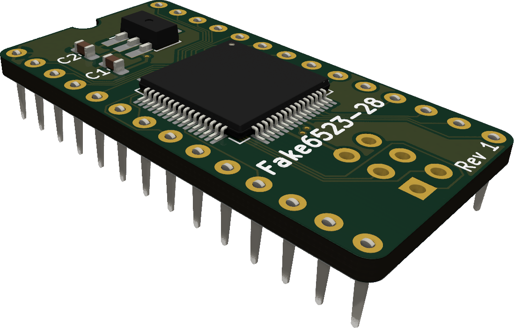

# Fake6523-28
Replacement for the 28-pin version of the MOS 6523 tri-port interface used in the Commodore 1551 paddle.

This project is a scaled down version of the [Fake6523](https://github.com/go4retro/Fake6523) (40-pin) created by Jim Brain. 
The verilog code for the CPLD is based on code created by Maciej Witkowiak for the [TCBM2SD](https://github.com/ytmytm/plus4-tcbm2sd).  
This version is based on the XC9572XL-10VQ64 but it could possibly be ported to a smaller CPLD. 

The Fake6523-28 has not gone through any extensive testing yet.
